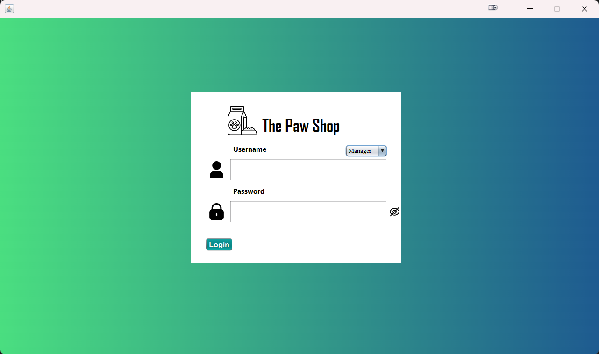
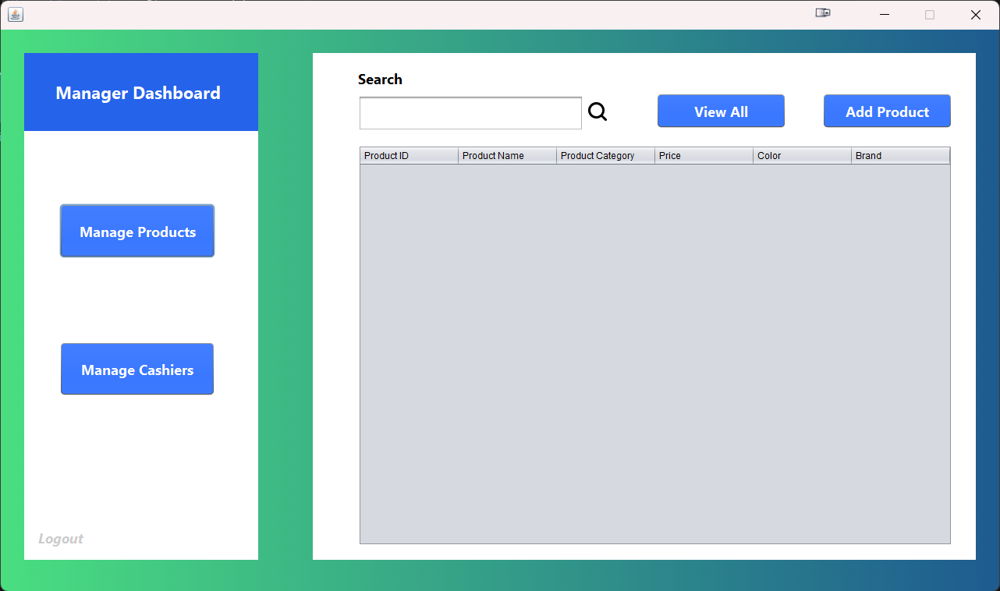
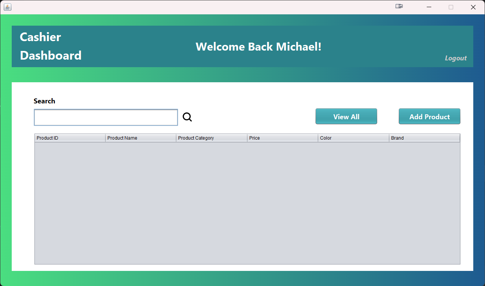

# The Paw Shop - Inventory Management System

An inventory management system for a pet supply store, developed using **Java** and **Swing** as part of my first-year university assignment.  
The system focuses on showcasing robust **Object-Oriented Programming (OOP)** concepts such as **inheritance**, **encapsulation**, **abstraction**, and **polymorphism** through a fully functional desktop application.

---

## Project Overview

The Paw Shop Inventory System provides two distinct user roles:

- **Manager**: Full access to manage products and cashier accounts.
- **Cashier**: Limited access to manage product entries.

The system allows for:

- Secure login based on role.
- Product management (add, view, search).
- Cashier account management (register, view, search).
- Data persistence via text files.

---

## Tech Stack

- **Language**: Java
- **GUI Framework**: Java Swing
- **Architecture**: MVC (Model-View-Controller)
- **Storage**: Local text files (`Product.txt`, `CashierCreds.txt`)

---

## User Interface Preview

### Authentication Interface



### Manager Dashboard



### Cashier Dashboard



---

## Core Features

- **Role-based Login System** (Manager & Cashier)
- **Product Management**
  - Add new products
  - View all products
  - Search products by ID or category
- **Cashier Management** (Manager only)
  - Register new cashier accounts
  - View all registered cashiers
  - Search cashiers by ID or name
- **Persistent Storage**
  - Product and cashier data are stored locally using text files
- **Secure Logout** functionality for both roles

---

## Getting Started

### Prerequisites

- Java Development Kit (JDK) installed
- Java IDE (Apache NetBeans)

### Running the Application

1. Clone this repository:
   ```bash
   git clone https://github.com/your-username/the-paw-shop.git
   ```
2. Navigate to the `ThePawShop/dist/` directory inside the project.
3. Run the application by either:

- **Double-clicking** on `ThePawShop.jar`
- **OR** using the terminal/command prompt:
  ```bash
  java -jar ThePawShop/dist/ThePawShop.jar
  ```

---

### Default Login Credentials

- **Manager Username**: `SuperAdmin`
- **Manager Password**: `Admin`
- _(Cashier accounts must first be created by the Manager through the application.)_